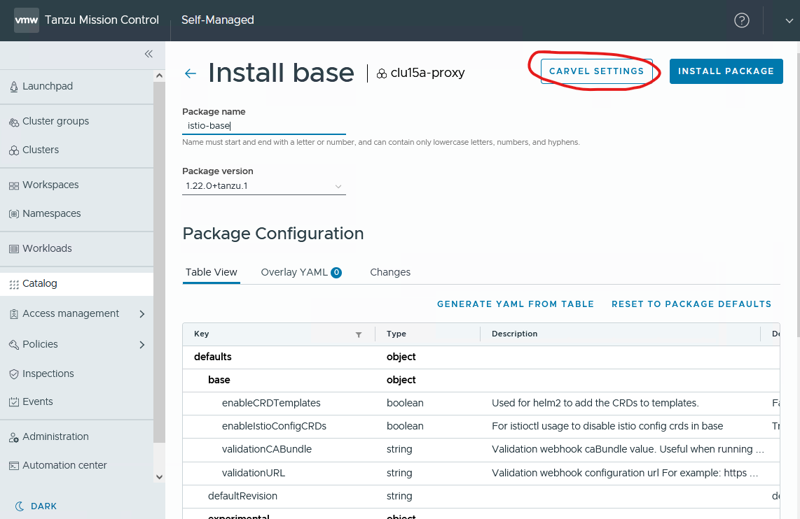
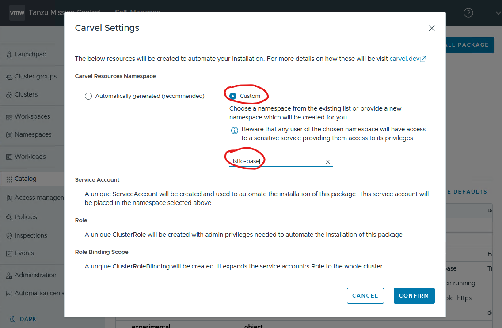

# TMC-SM Customizations

## GitLab_Auth_Overlays

>**NOTE:** from TMC-SM 1.3, this overlay is not required. More information can be found in https://docs.vmware.com/en/VMware-Tanzu-Mission-Control/1.3/tanzumc-sm-install/install-config-keys.html **oidc.authorizationScopes** key

When integrating GitLab (on premise installation) as the OIDC provider for TMC-SM, the default pinniped configuration prevents to do so.

As highlighted in this [doc](https://pinniped.dev/docs/howto/supervisor/configure-supervisor-with-gitlab/), it seems that "offline_access" scope is not working with GitLab, however it set by default in the OIDCIdentityProvider pinniped-upstream

```
    # GitLab is unusual among OIDC providers in that it returns an
    # error if you request the "offline_access" scope during an
    # authorization flow, so ask Pinniped to avoid requesting that
    # scope when using GitLab by excluding it from this list.
    # By specifying only "openid" here then Pinniped will only
    # request "openid".
```

The Overlays in this folder are removing the ```"offline_access"``` scope from the OIDCIdentityProvider at PackageInstall level after TMC installation has been done, so that Kapp controller will reconcile the required TMC packages, and thus, fix the OIDCIdentityProvider CRD to properly configure the GitLab integration for Authentication via OIDC.

To apply these overlays, the following command must be run:

```
kubectl get PackageInstall -n tmc-local tanzu-mission-control -o yaml | ytt -f tmc.yaml -f tmc-overlay.ytt -f tmc-local-stack-overlay.ytt --file - | k apply -f -
```

## Istio_Packages_Overlays

>**NOTE:** Istio packages are provided from TMC-SM 1.3

This Overlay sets up istio-system namespace labels for PSA in K8S > 1.26. This is required as stated in this doc: https://docs.vmware.com/en/VMware-vSphere/8.0//vsphere-with-tanzu-tkg/GUID-B57DA879-89FD-4C34-8ADB-B21CB3AE67F6.html

ISTIO packages need to be installed in a specific order:
1. base
2. istiod
3. gateway

When installing the istio-base package from TMC-SM, click the **CARVEL SETTINGS** option before clicking the INSTALL PACKAGE button, and configure a Custom namespace for the PackageInstall CRD:

* istio-base 

 

 

After the istio-base package has been installed, this overlay needs to be applied by running the following command:

```
kubectl get PackageInstall -n istio-base istio-base -o yaml | ytt -f istio-base-overlay.yaml --file - | k apply -f -
```